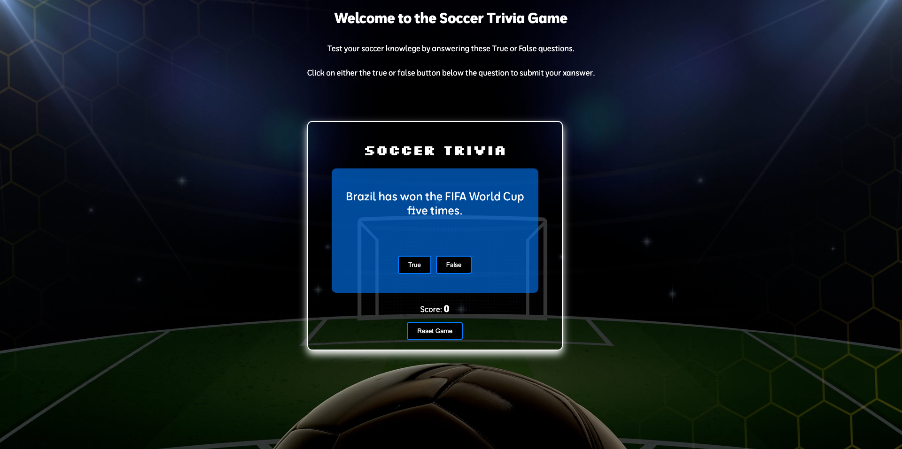

# **Soccer Trivia Game**
[Deployed Game Link](https://paolasoria0597.github.io/Soccer-Trivia-Game/)

Welcome to the Soccer Trivia Game! This is a fun interactive trivia game that will test your knowledge about soccer. This game depicts a series of true/false questions, with feedback and scroing provided once an answer is submitted.

# **Table of Contents**
- Attributions
- Project Description
- Game features
- Technologies used
- How to play
- Project Structure
- Future Enhancements

# **Attributions**
All sounds provided by [Zapsplat](https://www.zapsplat.com/) is licensed under [CC BY 4.0](https://creativecommons.org/licenses/by/4.0/).
 - cheer.mp3
 - goal.mp3
 - whistle.mp3

# **Project Description**
This game challenges users with a series of fifteen soccer related trivia questions. The player must answer each question as either "true" or "false". After answering each question, the correct answer and a brief explanation are revealed and the player's score is updated. Once all the questions are answered the final score is displayed along with the option to restart the game. The reason behind creating this game is to test the knowledge of users who are big soccer fans just like me or who are just curious to learn some interesting facts about the sport.

##link to project planning 
# **Game Features**

1. True/false Questions: The player answers the soccer related trivia question displayed on each card by choosing "true" or "false".

2. Score Tracking: The player's score is updated below the question card.

3. Feedback: An explanation as to why the answer is correct or incorrect will be provided along with additional information and a sound effect.

4. Card-flip animation: The card flips as soon as the player chooses an answer and the result along with the feedback is displayed.

5. Final score: After the last trivia question is answered a final score is revealed along with a small gif image.

6. Restart option: After finishing the game, the player has the option to restart the game and improve their score.

# **Technologies used**:
- HTML: used to structure the game layout.
- CSS : used to style the game with animations, flexbox, and visuals.
- JavaScript: used to provide game logic, animation, and interactivity.

# **Future Enhancements**:

- Add more animations
- Add more trivia card questions and have different ways to display them.
- Expand Trivia Questions to be more than true/false
- Add different difficulty levels.
